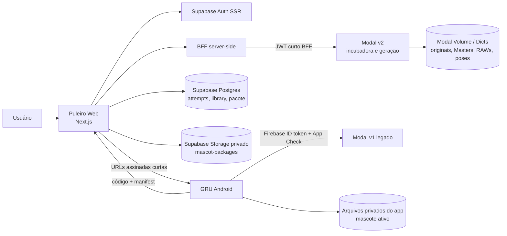
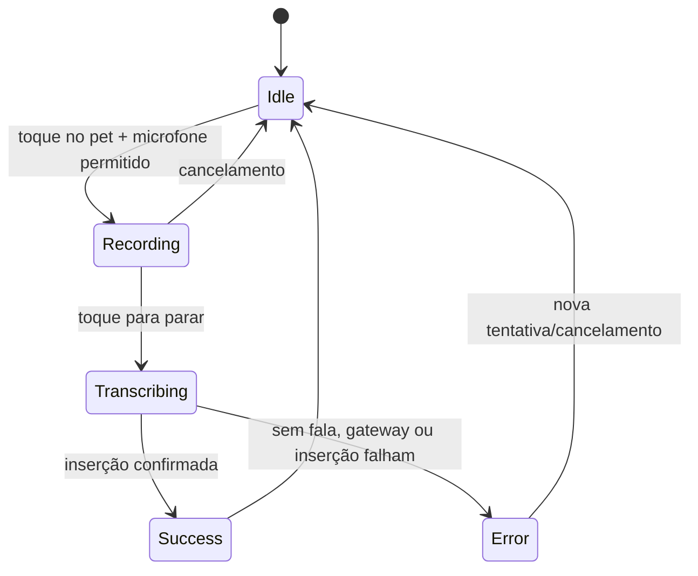
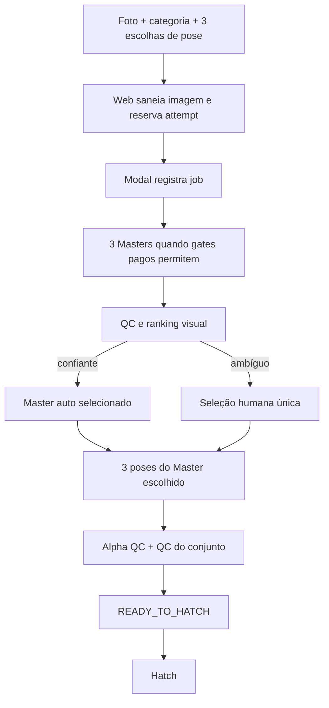
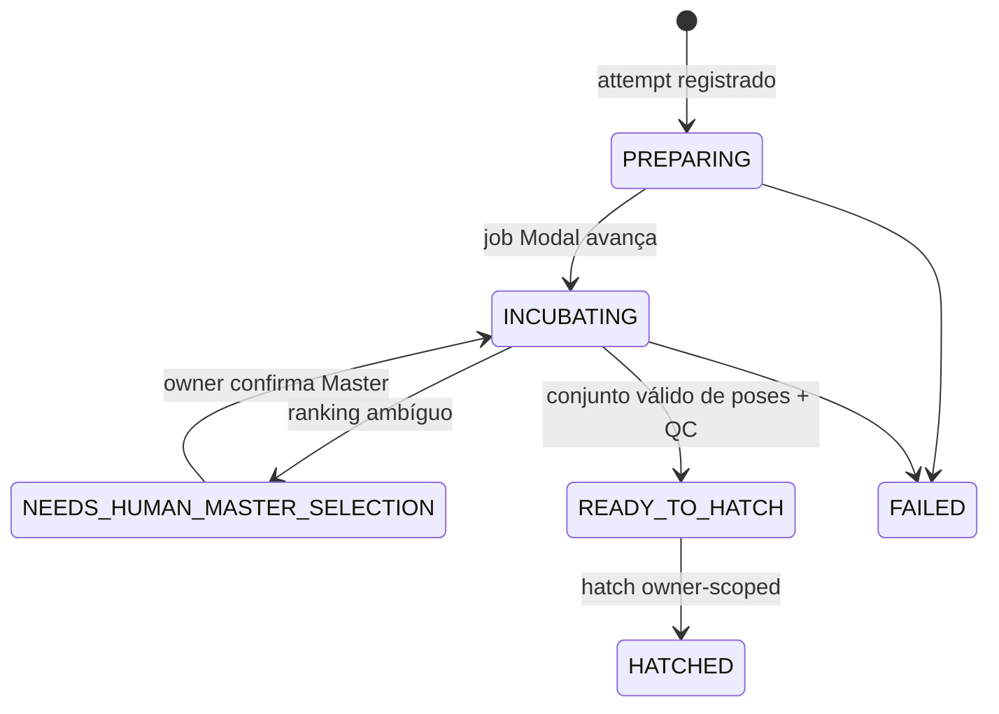
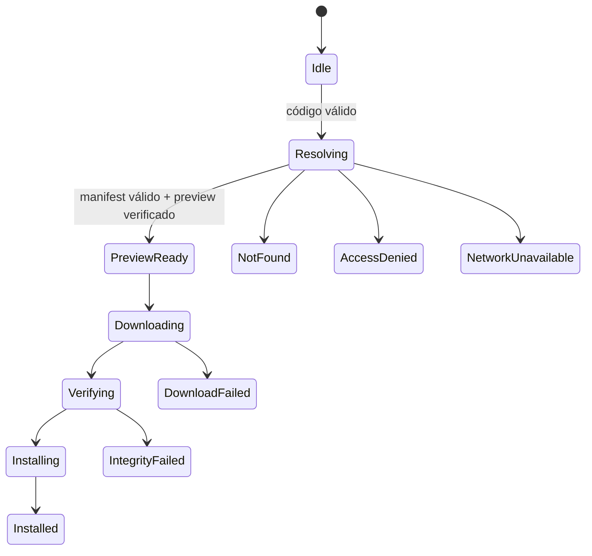
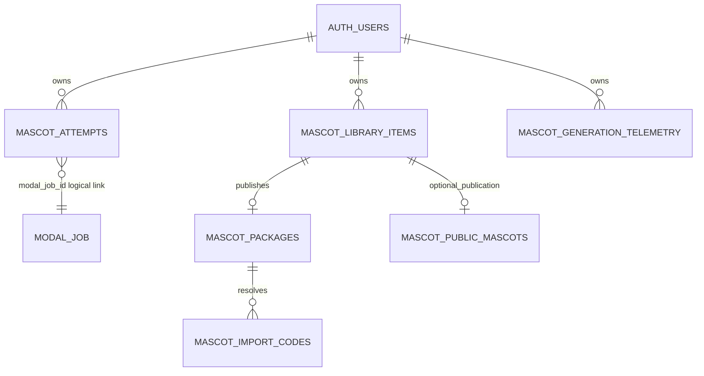

# Handoff técnico completo — GRU / Puleiro do GRU

> Documento consolidado para Hermes. Gerado a partir do handoff principal e dos módulos em `docs/agent-handoff/`.

## Como usar

Este arquivo reúne todo o conteúdo do handoff em um único Markdown. O snapshot de GitHub documentado é de 07/09/2026 e deve ser revalidado antes de merge, deploy, GPU ou mudanças em Production.

---


<!-- INÍCIO: HERMES_HANDOFF.md -->

# Handoff técnico — GRU / Puleiro do GRU

Este é o ponto de entrada para **Hermes**, o próximo agente de desenvolvimento.
Ele descreve o ecossistema a partir de código e GitHub consultados em 07/09/2026.
Não trata planos, PRs abertos ou relatórios anteriores como funcionalidades entregues.

## Leitura em 10 minutos

1. [Visão geral e fonte de verdade](docs/agent-handoff/00_README.md)
2. [Arquitetura do ecossistema](docs/agent-handoff/01_ECOSYSTEM_ARCHITECTURE.md)
3. [Estado atual, PRs e ordem de integração](docs/agent-handoff/12_CURRENT_STATUS.md)
4. [Regras obrigatórias de trabalho](docs/agent-handoff/14_AGENT_RULES.md)

## Resposta rápida

| Pergunta | Resposta verificada |
| --- | --- |
| O que é? | GRU é um app Android de ditado com mascote flutuante; Puleiro é o Web/BFF para criar, organizar e, em fase posterior, entregar mascotes. |
| Repositórios | `Pguillen87/gru` (Android + Modal) e `Pguillen87/PuleiroGru` (Next.js, BFF e Supabase migrations). |
| Como se conectam? | Browser autenticado → BFF Next.js → Modal v2; Android legado → Modal v1 com Firebase/App Check; pacote Web → importador Android V1. |
| Onde estão os dados? | Metadados no Supabase; assets de geração no Volume Modal; pacote publicado no Storage privado do Supabase; mascote instalado no armazenamento privado Android. |
| Regra crítica | Browser não é autoridade para operações sensíveis. Owner scope, BFF, idempotência e gates server-side são obrigatórios. |
| Estado atual | Incubadora assíncrona está parcialmente mergeada; os PRs de recovery de assets e endurecimento de QC/hatch permanecem abertos. Consulte a tabela de status antes de agir. |
| Próximo trabalho recomendado | Auditoria dos PRs abertos; só depois merge, deploy QA e recovery CPU do job QA já existente. Não iniciar GPU por padrão. |

## Limites desta documentação

- Ela descreve o **código versionado** e o estado do GitHub observado na data acima.
- Configurações efetivas de Vercel, Modal, Supabase, secrets, tasks e Production são marcadas como **NÃO VERIFICÁVEL** quando não foram consultadas no runtime nesta investigação.
- URLs privadas, fotos, tokens, segredos e dados de usuários não são registrados.

## Mapa completo

- [Android](docs/agent-handoff/02_GRU_ANDROID.md)
- [Web e BFF](docs/agent-handoff/03_PULEIRO_WEB.md)
- [Incubadora e pipeline de imagens](docs/agent-handoff/04_INCUBATOR_AND_IMAGE_PIPELINE.md)
- [Máquinas de estado](docs/agent-handoff/05_STATE_MACHINES.md)
- [APIs e contratos](docs/agent-handoff/06_APIS_AND_CONTRACTS.md)
- [Supabase e Storage](docs/agent-handoff/07_DATA_SUPABASE_STORAGE.md)
- [Segurança e privacidade](docs/agent-handoff/08_SECURITY_PRIVACY.md)
- [Operações Modal/GPU](docs/agent-handoff/09_MODAL_GPU_OPERATIONS.md)
- [Deploy, QA e observabilidade](docs/agent-handoff/10_DEPLOY_QA_OBSERVABILITY.md)
- [Testes](docs/agent-handoff/11_TESTING.md)
- [Trabalho aberto e roadmap](docs/agent-handoff/13_OPEN_WORK_AND_ROADMAP.md)
- [Glossário](docs/agent-handoff/15_GLOSSARY.md)

## Fontes no código

- `Pguillen87/PuleiroGru` `main` em `41c7f4f131ceb7c53e405b4bdcac95e5cbdfe1a3`.
- `Pguillen87/gru` `main` em `0f9330646ae44d41f498405d706a1d7e576e5cbc`.
- GitHub: PRs abertos consultados em 07/09/2026.

<!-- FIM: HERMES_HANDOFF.md -->

---

<!-- INÍCIO: C:\App\_worktrees\puleiro-hermes-handoff\docs\agent-handoff\00_README.md -->

# 00 — Como usar este handoff

## Fonte canônica escolhida

Esta documentação fica em `Pguillen87/PuleiroGru/docs/agent-handoff/` porque esse repositório contém o BFF que integra browser, Supabase, Modal e o pacote Android, além das migrations de dados. O repositório `Pguillen87/gru` continua sendo a fonte canônica do Android e do Modal; cada seção aponta diretamente para seus arquivos.

Não duplicar estes documentos no repositório GRU. Quando uma decisão exclusiva de Android ou Modal precisar de documentação operacional própria, registrá-la junto ao código correspondente e referenciá-la aqui.

## Convenções de evidência

| Marca | Significado |
| --- | --- |
| **IMPLEMENTADO** | Encontrado no código versionado da branch indicada. |
| **EM PRODUÇÃO** | Exigiria comprovação de deploy/runtime; não inferir de código. |
| **EM ANDAMENTO** | Está em PR aberto ou branch, não em `main`. |
| **BLOQUEADO/PENDENTE** | Falta implementação, decisão ou pré-condição. |
| **NÃO VERIFICÁVEL** | Não houve evidência suficiente nesta investigação. |
| **HIPÓTESE** | Inferência explicitamente identificada; não usar para operar. |

## Ordem de leitura para Hermes

1. Leia `14_AGENT_RULES.md` antes de qualquer alteração.
2. Confira `12_CURRENT_STATUS.md` contra GitHub; o estado pode ter mudado desde este snapshot.
3. Para Web/BFF, leia `03_PULEIRO_WEB.md`, `06_APIS_AND_CONTRACTS.md` e `07_DATA_SUPABASE_STORAGE.md`.
4. Para geração, leia `04_INCUBATOR_AND_IMAGE_PIPELINE.md`, `05_STATE_MACHINES.md` e `09_MODAL_GPU_OPERATIONS.md`.
5. Para Android, leia `02_GRU_ANDROID.md` antes de tocar no manifesto ou no contrato de importação.

## Princípios operacionais que prevalecem

- Não assumir que merge, deploy e QA são a mesma coisa.
- Não executar GPU, retry pago, recovery remoto ou alteração em Production sem autorização explícita.
- Um `jobId` sozinho não autoriza acesso: todas as operações devem ser owner-scoped.
- Todo POST com efeito persistente ou custo precisa de idempotência server-side.
- Em operação GPU ambígua, consultar operação/call/output persistidos antes de qualquer retry.
- Preservar Android V1: o pacote contém somente `NORMAL`, `LISTENING` e `TRANSCRIBING`; Master não entra no pacote.

## Fontes no código

- `README.md`, `docs/ASYNC_INCUBATOR_V1.md`, `docs/MODAL_CONTRACT.md`, `supabase/migrations/` em `Pguillen87/PuleiroGru@41c7f4f`.
- `README.md`, `modal_service/ARCHITECTURE.md`, `modal_service/OPERATIONS.md` em `Pguillen87/gru@0f93306`.

<!-- FIM: C:\App\_worktrees\puleiro-hermes-handoff\docs\agent-handoff\00_README.md -->

---

<!-- INÍCIO: C:\App\_worktrees\puleiro-hermes-handoff\docs\agent-handoff\01_ECOSYSTEM_ARCHITECTURE.md -->

# 01 — Arquitetura real do ecossistema

## Visão geral

O ecossistema tem dois caminhos de mascote que coexistem:

1. **Android V1 / Modal v1**: o app GRU conversa diretamente com o Modal usando Firebase ID token e App Check. É um contrato separado.
2. **Puleiro Web / Modal v2**: o browser autentica no Supabase e chama apenas o BFF Next.js; o BFF assina um JWT curto e owner-scoped para o Modal.

O pacote Android é produzido pelo Web a partir de poses existentes. O Modal gera assets, mas não é a fonte de verdade do pacote publicado.



## Responsabilidades e fronteiras

| Componente | Responsabilidade encontrada | Não é sua responsabilidade |
| --- | --- | --- |
| GRU Android | Ditado, overlay, estado local, validação e promoção local do pacote. | Orquestrar a Incubadora Web ou decidir ranking v2. |
| Puleiro Web | UX, sessão Supabase, BFF, attempts, biblioteca, publicação de pacote. | Expor secrets Modal ao browser ou executar GPU diretamente. |
| Modal | Jobs assíncronos, geração, QC, volumes, gates e assets privados. | Biblioteca final e pacote Android publicados. |
| Supabase | Auth, RLS, metadados owner-scoped, Storage privado do pacote. | Worker de geração. |

## Comunicação síncrona e assíncrona

- **Síncrona:** browser → API Next; BFF → Modal para registro, consulta, seleção e streaming privado; Android → Modal v1; Android → endpoint Web de importação quando um resolver estiver configurado.
- **Assíncrona:** job Modal, reconciliador e workers de Master/poses. O Web consulta o estado; não deve inferir que uma request criou ou concluiu GPU sem confirmação do job.
- **NÃO VERIFICÁVEL:** broker externo, outbox implantado, tracing distribuído e alertas ativos no runtime não foram confirmados nesta investigação.

## Decisões arquiteturais confirmadas

1. **BFF como fronteira Web→Modal:** a sessão Supabase é validada no servidor e o browser não recebe credencial Modal.
2. **Owner scope em camadas:** RLS limita registros Supabase; o BFF monta `JobIdentity` com owner e attempt; Modal v2 valida a identidade BFF.
3. **Pacote separado da geração:** gerar poses não equivale a pacote pronto nem a instalação Android.
4. **Dois contratos Android/Web:** o contrato Android v1 usa Firebase/App Check; Puleiro Web usa Supabase/BFF. Não os misturar silenciosamente.

## Divergência a preservar

`modal_service/ARCHITECTURE.md` em `main` descreve um fluxo de seis poses MVP e Android que baixa assets do Modal. Já o contrato Web/Android V1 atual aponta para três roles operacionais e pacote publicado pelo Web. Tratar esse documento Modal como histórico parcialmente divergente até revisão explícita.

## Fontes no código

- Web: `README.md`, `lib/mascot-generation/modal-auth.ts`, `lib/mascot-generation/modal-provider.ts`.
- Modal: `modal_service/ARCHITECTURE.md`, `modal_service/app.py`, `modal_service/bff_auth.py`.
- Android: `app/build.gradle.kts`, `app/src/gru/kotlin/com/pguillen/gru/mascot/MascotApi.kt`, `.../importing/MascotPackageInstaller.kt`.

<!-- FIM: C:\App\_worktrees\puleiro-hermes-handoff\docs\agent-handoff\01_ECOSYSTEM_ARCHITECTURE.md -->

---

<!-- INÍCIO: C:\App\_worktrees\puleiro-hermes-handoff\docs\agent-handoff\02_GRU_ANDROID.md -->

# 02 — GRU Android

## Finalidade e stack

**IMPLEMENTADO no código:** GRU é um app Android Kotlin/Jetpack Compose de ditado com mascote flutuante. O pacote usa namespace e application ID `com.pguillen.gru`, Compose, Firebase Auth, Firebase App Check e um runtime local baseado em `whisper.cpp`.

Entry points principais:

- `GruApplication.kt`: inicialização de preferências, modelos e serviços de app.
- `GruActivity.kt`: atividade principal e navegação Compose.
- `GruAccessibilityService.kt`: observa foco/campo editável/IME, injeta texto e cria o overlay.
- `GruPetOverlayController.kt`: renderiza e controla o mascote flutuante.

## Ditado: máquina de estado própria



`GruSessionCoordinator` controla a máquina. Ele grava áudio temporário, escolhe um gateway uma vez por sessão, insere o texto via acessibilidade e apaga o arquivo de áudio no `finally`. Os modos confirmados no README são Groq online e Whisper local; o app não usa fallback automático de um para outro.

Esta máquina não é controlada pelo Modal nem pelo Puleiro. Ela deve permanecer independente da máquina de estado da Incubadora.

## Permissões e lifecycle

O manifesto principal declara `INTERNET`, `RECORD_AUDIO`, notificação e serviço foreground de microfone. `GruAccessibilityService` é exportado e protegido por `BIND_ACCESSIBILITY_SERVICE`. O app desabilita backup e cleartext traffic.

O overlay só deve ficar visível quando a política local permitir: app habilitado, engine disponível, campo editável focado e IME visível. Campos de senha são deliberadamente excluídos pela heurística de acessibilidade.

## Mascotes no Android

Há dois tipos de origem:

- **Built-in:** atlas incluídos nos recursos do APK.
- **Custom:** `CustomMascotStore` em `filesDir/mascots`, resolvido por `MascotVisualResolver` por estado local `IDLE`, `RECORDING`, `TRANSCRIBING`.

O armazenamento local valida checksum antes de usar um arquivo. A promoção escreve em staging, substitui o diretório de destino de forma recuperável e só então elimina o backup.

## Contrato do pacote Android V1

**IMPLEMENTADO no código:** `MascotImportManifest` suporta schema `1` e exige exatamente três roles distintas:

| Role de pacote | Estado visual Android |
| --- | --- |
| `NORMAL` | `IDLE` |
| `LISTENING` | `RECORDING` |
| `TRANSCRIBING` | `TRANSCRIBING` |

O manifest exige preview igual à pose `NORMAL`, SHA-256, tamanho, MIME permitido e IDs seguros. O instalador recusa pacote parcial, MIME/size/dimensões/checksum inválidos e só promove as três poses juntas. Download permite somente HTTPS público, sem redirecionamento livre para hosts locais/privados.

**BLOQUEADO/PENDENTE:** em `main`, o resolver de código é `UnavailableMascotCodeResolver`; o próprio código diz que a resolução de produção pelo endpoint Web é futura. Portanto, não afirmar que a importação end-to-end já está ativa só porque o parser e instalador existem.

## API Android legado

`MascotApi.kt` chama rotas `/v1/mascot/...` no Modal e usa Firebase token + App Check. Esse caminho é separado do BFF Supabase do Puleiro. A URL é definida no `BuildConfig` de Android; não documentar nem alterar valores de ambiente como se fossem configuração Web.

## Testes e build

Comandos declarados no README:

```powershell
.\gradlew.bat :app:assembleDebug
.\gradlew.bat :app:testDebugUnitTest
.\gradlew.bat :app:lintDebug
.\gradlew.bat :app:connectedDebugAndroidTest
```

**NÃO VERIFICÁVEL nesta investigação:** execução atual desses comandos, dispositivo conectado, release instalado e importação real por código.

## Fontes no código

- `Pguillen87/gru@0f93306`: `README.md`, `app/build.gradle.kts`, `app/src/gru/AndroidManifest.xml`.
- `.../dictation/GruDictationState.kt`, `.../GruSessionCoordinator.kt`.
- `.../overlay/GruAccessibilityService.kt`, `.../overlay/GruPetOverlayController.kt`.
- `.../mascot/CustomMascotStore.kt`, `.../mascot/MascotApi.kt`, `.../mascot/importing/MascotImportModels.kt`, `MascotPackageInstaller.kt`, `MascotCodeResolver.kt`.

<!-- FIM: C:\App\_worktrees\puleiro-hermes-handoff\docs\agent-handoff\02_GRU_ANDROID.md -->

---

<!-- INÍCIO: C:\App\_worktrees\puleiro-hermes-handoff\docs\agent-handoff\03_PULEIRO_WEB.md -->

# 03 — Puleiro Web e BFF

## Stack e entrada

**IMPLEMENTADO:** `Pguillen87/PuleiroGru` usa Next.js 16 App Router, React 19, TypeScript, Supabase SSR/JS, `jose` para JWT BFF e `sharp` para saneamento de imagens. As rotas estão em `app/`; o BFF está co-localizado nas Route Handlers `app/api/mascot/`.

Páginas principais encontradas em `main`:

| Página | Responsabilidade |
| --- | --- |
| `/` | Central do Puleiro. |
| `/criar` | Fluxo de criação. |
| `/incubadora/[jobId]` | Diário/detalhe de incubação. |
| `/meus-mascotes` | Biblioteca pessoal. |
| `/explorar` | Comunidade. |

Uma página índice exclusiva `/incubadora` não foi encontrada em `main`; a separação visual completa da Incubadora é roadmap, não fato entregue.

## Sessão e fronteira BFF

1. Browser usa Supabase SSR; `requireBrowserIdentity()` confirma a sessão.
2. Rotas BFF derivam `identity.uid` no servidor.
3. `modal-auth.ts` emite JWT HS256 curto para Modal, com issuer/audience/owner/attempt definidos pelo contrato.
4. O browser chama apenas `/api/mascot/...`; não deve receber secret, JWT BFF, path interno de Volume ou URL Modal privada.

Mutações usam `requireTrustedMutationRequest()` e as rotas críticas validam owner e attempt no servidor. A imagem é reencodada com `sharp`; tipos aceitos no código são JPEG, PNG e WebP.

## Attempt, recovery e idempotência

`mascot_attempts` é a âncora Web de recuperação. Para Incubadora assíncrona:

- POST de incubação deriva attempt determinístico de `X-Puleiro-Incubation-Key`.
- O BFF reserva/recupera attempt no Supabase antes de criar o job Modal.
- Quando `modal_job_id` está ausente, o GET de incubadora consulta Modal pelo mesmo owner+attempt e só persiste o vínculo se o attempt retornado coincidir.
- Recovery de leitura não cria job, reenvia foto nem agenda GPU.

O cookie `puleiro_attempt` existe para compatibilidade/continuidade, mas o recovery assíncrono não pode depender exclusivamente dele.

## Biblioteca e pacote

Biblioteca e comunidade são owner-scoped no Supabase. A publicação de pacote V1 é uma operação separada do nascimento: reutiliza poses existentes, grava o manifest no Storage privado e entrega código de importação pelo BFF. Consulte `07_DATA_SUPABASE_STORAGE.md`.

## Divergências relevantes

- `README.md` descreve parte do encoder visual como TorchScript, enquanto o Modal `main` contém inicialização ONNX com `CPUExecutionProvider`. Registrar isso como documentação antiga divergente.
- O README também afirma que o pacote/código está em fase posterior; o código Web já possui rota de publicação. A operação real em ambiente publicado continua **NÃO VERIFICÁVEL**.

## Fontes no código

- `package.json`, `app/`, `components/`, `lib/auth/`, `lib/security/mutation-request.ts`.
- `lib/mascot-generation/attempt.ts`, `attempt-store.ts`, `incubation-recovery.ts`, `modal-auth.ts`, `modal-provider.ts`, `package-store.ts`.
- `app/api/mascot/incubations/route.ts`, `app/api/mascot/library/`, `app/api/mascot/import/[code]/route.ts`.

<!-- FIM: C:\App\_worktrees\puleiro-hermes-handoff\docs\agent-handoff\03_PULEIRO_WEB.md -->

---

<!-- INÍCIO: C:\App\_worktrees\puleiro-hermes-handoff\docs\agent-handoff\04_INCUBATOR_AND_IMAGE_PIPELINE.md -->

# 04 — Incubadora e pipeline de imagens

## Fluxo assíncrono observado no código



O diagrama mostra a intenção e os contratos encontrados; não significa que cada transição esteja ativa em Production.

## Estágio por estágio

| Estágio | Evidência | Estado atual |
| --- | --- | --- |
| Upload, EXIF removal e confirmação de sujeito | BFF Web e testes | IMPLEMENTADO |
| Attempt owner-scoped e registro assíncrono | `main` Web/Modal após PRs #9 mergeados | IMPLEMENTADO |
| SigLIP ONNX CPU para hint/ranking | `modal_service/incubator.py` | IMPLEMENTADO no código; runtime Production NÃO VERIFICÁVEL |
| Política `master-ranker-policy-v1` | `incubator.py`, ADR e testes | IMPLEMENTADO no código |
| Seleção humana de Master | rotas de incubação e Web | IMPLEMENTADO no código; QA histórico registrado nos PRs anteriores |
| Geração de poses | Modal v2 e templates | IMPLEMENTADO com gates; runtime depende de flags/templates |
| QC `pose-set-visual-v2` | `main` Modal | IMPLEMENTADO, mas o job QA de referência encontrou falso positivo visual |
| QC `pose-set-visual-v3` e recovery CPU | Modal PR aberto | EM ANDAMENTO |
| READY_TO_HATCH endurecido e hatch Web | Web PR aberto | EM ANDAMENTO |

## Visual encoder, ranking e seleção

O Modal `main` contém `OnnxVisualEncoder` que exige manifest/checksum e cria `onnxruntime.InferenceSession` somente com `CPUExecutionProvider`. Ausência, checksum inválido ou provider diferente falham fechado.

`master-ranker-policy-v1` é deliberadamente conservadora: elegibilidade vem de hard gates; 0 elegíveis falha, 1 elegível pede humano, 2–3 podem auto-selecionar somente quando score e margem atendem a política publicada. Os valores devem ser lidos de `modal_service/incubator.py`, não reinventados em cliente.

**NÃO VERIFICÁVEL:** Qwen e SAM 2 como componentes ativos no `main` consultado. Eles foram pedidos como tópicos de investigação, mas não foram confirmados nesta leitura como dependências/código operacional do fluxo atual.

## Imagens, alpha e assets

O pipeline Modal possui módulos de processamento e QC. A geração guarda assets privados no Volume Modal; o BFF entrega Master/poses por proxy owner-scoped. O pacote Android final é outra cópia controlada no Supabase Storage.

O job QA histórico de referência teve três RAWs gerados e preservados, mas foi reprovado por `VISUAL_POSE_CONSISTENCY_FAILED` no QC v2. A evidência registrada no PR Modal #11 classifica o conjunto como visualmente coerente e aponta o QC geométrico como excessivamente rígido para diferenças legítimas de role. Essa conclusão é **QA HISTÓRICO DOCUMENTADO EM PR**, não validação Production.

## QC V2 e V3

`pose-set-visual-v2` continua em `main` para auditoria histórica. O PR Modal #11 propõe v3 role-aware, hard gates adicionais de framing e recovery CPU dos RAWs preservados. Até merge, o v3 não deve ser tratado como contrato publicado.

## O que nunca fazer no pipeline

- Não gerar poses para todos os Masters; gerar somente para o Master aprovado.
- Não repetir GPU após timeout/estado ambíguo antes de verificar call, operação e output persistidos.
- Não promover conjunto parcial.
- Não expor RAW, foto, embedding, path do Volume ou URL privada no browser/log.
- Não modificar thresholds só para aprovar um único exemplo QA.

## Fontes no código

- Modal `main`: `modal_service/incubator.py`, `image_processing.py`, `app.py`, `templates.py`, `catalog.py`.
- Web `main`: `docs/ASYNC_INCUBATOR_V1.md`, `lib/mascot-generation/incubation-input.ts`, `types.ts`.
- PR pendente: `Pguillen87/gru#11`.

<!-- FIM: C:\App\_worktrees\puleiro-hermes-handoff\docs\agent-handoff\04_INCUBATOR_AND_IMAGE_PIPELINE.md -->

---

<!-- INÍCIO: C:\App\_worktrees\puleiro-hermes-handoff\docs\agent-handoff\05_STATE_MACHINES.md -->

# 05 — Máquinas de estado

## Regra de autoridade

Há máquinas separadas. Android decide seu estado de ditado/overlay local; Modal decide estados de job de geração; Supabase guarda a projeção/recovery Web; Puleiro projeta estados de produto. Nenhuma camada deve fingir ser a autoridade de outra.

## Incubadora Web/Modal



`IncubationProductState` no Web inclui `PREPARING`, `INCUBATING`, `NEEDS_HUMAN_MASTER_SELECTION`, `READY_TO_HATCH`, `HATCHED` e `FAILED`. É uma projeção; não criar uma segunda tabela de estados apenas para a UI.

### Invariante de `READY_TO_HATCH`

O invariante forte — Master aprovado, roles exatos `normal/listening/transcribing`, três assets, alpha/QC de conjunto, manifest/storage e evidência de conclusão — é **EM ANDAMENTO** no Modal PR #11 e no Web PR #11. O `main` atual não deve ser presumido como equivalente até merge e testes QA.

### Estados de job

O tipo Web contém valores como `registered`, `queued`, `generating_master`, `awaiting_master_selection`, `master_approved`, `generating_poses`, `awaiting_set_approval`, `completed`, `failed` e `canceled`. Modal é a fonte de verdade para o job; a tabela Supabase mantém `current_stage`/metadados de tentativa para recuperação.

## Android: ditado

`GruSessionCoordinator` usa `Idle`, `Recording`, `Transcribing`, `Success` e `Error`. Não se mistura com `READY_TO_HATCH` ou qualquer estado Modal.

## Android: importação de pacote



O instalador só promove o pacote quando possui e verifica as três poses. Falhas não ativam pacote parcial.

## Estados proibidos ou suspeitos

- `READY_TO_HATCH` com menos de três poses ou QC ausente: deve falhar fechado.
- HATCHED que cria package, biblioteca ou código Android automaticamente: fora do Plano 1 e não assumir.
- Job de outro owner recuperado por ID: proibido.
- Retry GPU sem checar operação anterior: proibido.

## Fontes no código

- Web: `lib/mascot-generation/types.ts`, `attempt-store.ts`, `docs/ASYNC_INCUBATOR_V1.md`.
- Android: `.../dictation/GruDictationState.kt`, `.../MascotCreation.kt`, `.../importing/MascotImportCoordinator.kt`.
- Modal: `modal_service/domain.py`, `modal_service/v2_contract.py`; PR #11 para invariantes pendentes.

<!-- FIM: C:\App\_worktrees\puleiro-hermes-handoff\docs\agent-handoff\05_STATE_MACHINES.md -->

---

<!-- INÍCIO: C:\App\_worktrees\puleiro-hermes-handoff\docs\agent-handoff\06_APIS_AND_CONTRACTS.md -->

# 06 — APIs e contratos relevantes

## Browser → BFF Web

| Método/rota | Caller e auth | Efeito / idempotência |
| --- | --- | --- |
| `POST /api/mascot/subject-hint` | sessão Supabase | Probe auxiliar; não substitui a escolha explícita do usuário. |
| `GET /api/mascot/capabilities` | sessão Supabase | Preflight sem criar job; o contrato de attempt exige leitura cuidadosa. |
| `GET /api/mascot/incubations` | sessão + owner | Lista/reconcilia vínculos existentes por owner+attempt; não cria job. |
| `POST /api/mascot/incubations` | sessão + origem confiável | Registra/reusa attempt com chave `X-Puleiro-Incubation-Key`; retorna job assíncrono. |
| `GET /api/mascot/incubations/{jobId}` | sessão + attempt owner-scoped | Lê job de incubação. |
| `POST /api/mascot/incubations/{jobId}/masters/{masterId}/select` | sessão + mutação confiável | Seleção humana owner-scoped. |
| `POST /api/mascot/incubations/{jobId}/hatch` | sessão + mutação confiável | Hatch; gate forte de ready é pendência no PR Web #11. |
| `GET /api/mascot/jobs/{jobId}/master/{masterId}` | sessão | Proxy privado de Master; recovery owner-scoped está no PR Web #10. |
| `GET /api/mascot/jobs/{jobId}/pose/{role}` | sessão | Proxy privado de pose; mesma dependência do PR Web #10. |
| `POST /api/mascot/library/{itemId}/package` | sessão + owner | Publica pacote V1 a partir de poses existentes; sem GPU. |
| `GET /api/mascot/import/{code}` | código válido | Resolve pacote pronto e emite URLs assinadas curtas. Rate limit em Production é pendente documentado. |

## BFF → Modal v2

O BFF assina JWT HS256 curto com `iss=puleiro-bff`, `aud=gru-modal`, `sub` do usuário Supabase, `jti`, `iat`, `exp` e `attempt_id`. O segredo é servidor-only. Não registrar valor de variável, token ou header de autorização.

Rotas relevantes documentadas/consumidas: criação e leitura de job, busca por attempt, streaming privado de Master/pose, capabilities, seleção de Master e operações de geração. A lista definitiva deve ser extraída do OpenAPI/handlers do deploy alvo antes de integrar novo cliente.

## Android → Modal v1

`MascotApi` Android usa Firebase ID token e Firebase App Check em `/v1/mascot/...`: criação, leitura, recovery por idempotência, geração de Master, aprovação, cancelamento, resultado e download. É contrato legado separado do BFF Web.

## Contratos imutáveis

- `attempt_id` e owner no JWT BFF devem coincidir com o recurso buscado.
- `subject-hint-policy-v2` e `subject-hint-v1` são allowlist Web; versões arbitrárias não são válidas.
- Roles operacionais são exatamente `normal`, `listening`, `transcribing` no Web/Modal e `NORMAL`, `LISTENING`, `TRANSCRIBING` no Android.
- URL de asset do Android import é HTTPS, host público, sem redirect livre/local e com checksum obrigatório.

## Erros

O BFF converte erros internos em resposta segura ao usuário. Falhas 4xx de validação/autorização não devem receber retry automático; falha de integração transitória deve preservar attempt/job para consulta posterior. Código e logs internos não devem aparecer ao usuário.

## Fontes no código

- Web: `app/api/mascot/`, `lib/mascot-generation/modal-auth.ts`, `modal-provider.ts`, `provider.ts`, `incubation-input.ts`, `lib/security/mutation-request.ts`.
- Modal: `modal_service/app.py`, `bff_auth.py`, `API_V2.md`.
- Android: `.../mascot/MascotApi.kt`, `.../mascot/importing/MascotImportModels.kt`.

<!-- FIM: C:\App\_worktrees\puleiro-hermes-handoff\docs\agent-handoff\06_APIS_AND_CONTRACTS.md -->

---

<!-- INÍCIO: C:\App\_worktrees\puleiro-hermes-handoff\docs\agent-handoff\07_DATA_SUPABASE_STORAGE.md -->

# 07 — Dados, Supabase e Storage

## O que é confirmado por migrations

As migrations versionadas do repositório Web criam e evoluem o modelo. Isso prova o esquema pretendido no código, não a aplicação em cada ambiente remoto.

| Entidade | Finalidade | Owner scope |
| --- | --- | --- |
| `mascot_attempts` | Tentativa Web, attempt ID, status, job Modal, configuração e recovery da Incubadora. | `user_id`; RLS para `auth.uid()`. |
| `mascot_library_items` | Biblioteca privada de mascotes concluídos. | `user_id`; RLS. |
| `mascot_generation_telemetry` | Métricas privadas de duração/custo somente quando verificáveis. | `user_id`; RLS. |
| `mascot_public_mascots` | Projeção explicitamente publicada para comunidade. | Publicação controlada pelo owner. |
| `mascot_public_mascot_favorites` / `saves` | Relações pessoais na comunidade. | `user_id`; RLS. |
| `mascot_packages` | Pacote Android V1 e manifest de entrega. | Owner/package via BFF e RLS declarada na migration. |
| `mascot_import_codes` | Código de importação, expiração/revogação e pacote relacionado. | Acesso indireto pelo BFF. |

## Attempt e Incubadora

A migration `20260829224244_add_async_incubator_attempt_metadata.sql` adiciona `workflow_mode`, configuração da incubação, `subject_hint`, seleção de Master, `generation_ready_at` e `hatched_at`. O check aceita `legacy_manual` e `async_incubator_v1`.

O fluxo deve preservar a unicidade do attempt por owner. Vínculo `modal_job_id` é salvo somente depois de validar que o job Modal pertence ao mesmo attempt.

## Pacote e bucket

O código Web chama o bucket privado `mascot-packages`. `package-store.ts` normaliza as três poses com Sharp, calcula SHA-256 e persiste manifest/asset metadata. A resolução por código deve gerar URL assinada curta, não tornar o bucket público.

O pacote operacional exige exatamente as três roles. O Master não integra o manifest Android V1.

## Relações simplificadas



`MODAL_JOB` não é tabela Supabase confirmada; representa o record persistido pelo Modal.

## Migrations encontradas

| Migration | Efeito principal |
| --- | --- |
| `20260813221145_create_mascot_attempts.sql` | tabela, índices, trigger de update e RLS de attempts. |
| `20260817143000_create_mascot_library_items.sql` | biblioteca e RLS. |
| `20260817180000_add_puleiro_community_and_telemetry.sql` | telemetria e comunidade. |
| `20260818120000_create_mascot_packages_and_import_codes.sql` | pacote, import codes e bucket/policies associados. |
| `20260825225134_harden_mascot_asset_quality_and_states.sql` | endurecimento de qualidade/estados. |
| `20260829224244_add_async_incubator_attempt_metadata.sql` | metadados da Incubadora. |

## Limites de evidência

- **NÃO VERIFICÁVEL:** migrations aplicadas em QA ou Production, conteúdo de buckets, backups, retenção e restores.
- Não usar service role no browser. O uso administrativo existe apenas em módulo servidor e não prova autorização ampla em rotas de usuário.
- Não registrar IDs reais de usuário, códigos de importação, assets ou dados de produção nesta documentação.

## Fontes no código

- `supabase/migrations/*.sql`.
- `lib/mascot-generation/attempt-store.ts`, `library-store.ts`, `package-store.ts`, `community-store.ts`.
- `docs/MASCOT_PACKAGE_V1.md`, `docs/MASCOT_PACKAGE_IMPORT.md`.

<!-- FIM: C:\App\_worktrees\puleiro-hermes-handoff\docs\agent-handoff\07_DATA_SUPABASE_STORAGE.md -->

---

<!-- INÍCIO: C:\App\_worktrees\puleiro-hermes-handoff\docs\agent-handoff\08_SECURITY_PRIVACY.md -->

# 08 — Segurança e privacidade

## Modelo observado

| Fronteira | Controle confirmado |
| --- | --- |
| Browser → Web | Sessão Supabase SSR; identidade derivada no servidor. |
| Mutação Web | Verificação de origem confiável e validação de payload. |
| Web → Modal v2 | JWT BFF curto, assinado no servidor, com owner/attempt. |
| Modal assets | Volume privado; assets servidos via BFF/proxy owner-scoped. |
| Supabase | RLS nas tabelas principais de attempts, biblioteca e telemetria. |
| Android → Modal v1 | Firebase ID token + Firebase App Check. |
| Android package | HTTPS, checksum, MIME/tamanho/dimensões e promoção atômica. |

## Regras que Hermes não pode quebrar

1. Nunca aceitar owner, `user_id`, attempt ou job como autoridade vinda apenas do browser.
2. Nunca mover segredo BFF/Modal/Supabase service-role para `NEXT_PUBLIC_*`, app Android ou cliente.
3. Nunca expor path Modal, URL assinada privada, original, RAW, embedding, JWT ou header `Authorization`.
4. Nunca usar um job global por ID sem resolver owner+attempt no Supabase/BFF.
5. Não transformar o Master em asset do pacote Android V1.
6. Não permitir pacote parcial; validar as três roles e checksums antes de promoção.
7. Não repetir GPU ambígua sem consultar operação/call/output persistidos.

## Fotos, metadados e logs

Web valida e reencoda JPEG/PNG/WebP com Sharp; a documentação do projeto declara remoção de EXIF/GPS/XMP/IPTC. Logs de geração devem registrar apenas metadados sanitizados: estágio, duração, quantidade de assets, versão de política/QC e IDs técnicos abreviáveis conforme política operacional. Não registrar imagem, Base64, nome original, EXIF, token, secret ou URL privada.

## LGPD e retenção

**BLOQUEADO/PENDENTE:** o documento Modal `SECURITY.md` prevê gate LGPD de consentimento, retenção, exclusão, App Check e evidências de release. A implementação e validação end-to-end de retenção/exclusão não foram confirmadas nesta investigação.

## Rate limiting e abuso

O README Web marca rate limiting/WAF da rota pública de importação como pendência para Production. Não afirmar que já há proteção efetiva sem configuração runtime comprovada.

## Checklist antes de alteração sensível

- [ ] Entidade autenticada e owner scope confirmados no servidor.
- [ ] Idempotency key estável para POST com efeito/custo.
- [ ] Erros transformados no boundary sem vazar detalhes internos.
- [ ] Logs com redaction e sem payload sensível.
- [ ] Migrations aditivas revisadas, RLS testada e sem uso de dados reais.
- [ ] Feature flag/GPU/Production explicitamente autorizados.

## Fontes no código

- Web: `README.md`, `lib/auth/browser-auth.ts`, `lib/security/mutation-request.ts`, `lib/mascot-generation/validation.ts`, `modal-auth.ts`.
- Modal: `modal_service/AUTHENTICATION.md`, `SECURITY.md`, `bff_auth.py`, `security.py`.
- Android: `AndroidManifest.xml`, `MascotPackageInstaller.kt`, `MascotImportModels.kt`.

<!-- FIM: C:\App\_worktrees\puleiro-hermes-handoff\docs\agent-handoff\08_SECURITY_PRIVACY.md -->

---

<!-- INÍCIO: C:\App\_worktrees\puleiro-hermes-handoff\docs\agent-handoff\09_MODAL_GPU_OPERATIONS.md -->

# 09 — Modal, GPU e operações assíncronas

## Recursos declarados pelo código/documentação Modal

| Recurso | Uso descrito |
| --- | --- |
| Volume de assets | Originais, Masters, RAWs/poses, templates e artefatos de consistência. |
| Volume de modelos | Cache/modelos. |
| Dict de jobs | Estado operacional do job. |
| Dict de idempotência | Proteção de create/operações replay. |
| Dict de usage | Quota e reserva de custo separadas. |
| Secrets | Credenciais server-side; nomes podem ser documentados, valores nunca. |

Os nomes de recursos em `modal_service/ARCHITECTURE.md` são evidência documental e devem ser confirmados no deploy alvo antes de qualquer operação. Não presumir que todos os Volumes/Dicts descritos existem em cada ambiente.

## Gates e custo

`modal_service/app.py` lê gates como `GPU_GENERATION_ENABLED`, `MASTER_GENERATION_ENABLED`, `POSE_GENERATION_ENABLED`, `INCUBATOR_FLOW_ENABLED` e `INCUBATOR_AUTO_RANKING_ENABLED`. Em código, Master exige GPU+flag Master e poses exigem GPU+flag Pose.

O registro assíncrono de incubação pode existir separado da capacidade de executar GPU. Desligar flags pagas não é permissão para criar job duplicado, nem motivo para o browser inventar que o job está pronto.

## Reconciliador e recovery

O código contém `reconcile_async_incubations()`. Ele é CPU/control-plane e deve fazer no-op seguro se gates pagos estiverem desligados. Uma execução GPU ambígua exige inspeção de operation/call/output antes de qualquer decisão de retry.

O Modal PR #11 propõe recovery CPU de RAWs históricos somente para falha de QC compatível. Ele deve preservar operação e GPU call históricas e não criar nova reserva, worker, operação, job ou attempt. Enquanto aberto, é **EM ANDAMENTO**.

## Encoder e templates

O encoder de Incubadora é ONNX local, com manifest/checksum e provider único `CPUExecutionProvider`. O pacote de templates possui versão e validação própria; a ausência de templates deve impedir geração de poses, não gerar fallback aleatório.

## Ambientes e deploy

**Confirmado no código:** existe script `modal_service/deploy_v2_production_fail_closed.ps1` e documentação de deploy fail-closed. **NÃO VERIFICÁVEL:** apps Modal ativos, nomes atuais de QA/Production, tasks em execução, flags efetivas, volumes montados e créditos/custos do momento.

## Runbook seguro para operação paga

1. Confirmar app/ambiente QA e Production intacta.
2. Registrar SHA, health, templates, encoder, flags e baseline de tasks.
3. Obter autorização explícita com teto/quantidade de operações.
4. Habilitar somente flags mínimas no QA.
5. Uma operação por vez; acompanhar idempotency/operation/GPU call.
6. Em falha ambígua, parar e inspecionar antes de retry.
7. Ao fim, desligar flags QA e preservar evidência sanitizada.

## Fontes no código

- `modal_service/app.py`, `config.py`, `coordinator.py`, `persistent_runtime.py`, `model_cache.py`, `templates.py`, `incubator.py`.
- `modal_service/OPERATIONS.md`, `COSTS.md`, `POSE_OPERATIONS.md`, `FIRST_GPU_SMOKE.md`.

<!-- FIM: C:\App\_worktrees\puleiro-hermes-handoff\docs\agent-handoff\09_MODAL_GPU_OPERATIONS.md -->

---

<!-- INÍCIO: C:\App\_worktrees\puleiro-hermes-handoff\docs\agent-handoff\10_DEPLOY_QA_OBSERVABILITY.md -->

# 10 — Deploy, QA e observabilidade

## O que é versionado

| Área | Evidência encontrada | Limite |
| --- | --- | --- |
| Web | Next scripts e configuração Supabase no repo; Preview Vercel aparece como check em um PR Web. | Projeto/variáveis/deploys efetivos não foram lidos. |
| Modal | Script de deploy fail-closed, `/health`, capabilities e docs operacionais. | App ativo, secrets e flags atuais NÃO VERIFICÁVEIS. |
| Android | Gradle build/test/lint e variants debug/release. | Build/release atual e device físico NÃO VERIFICÁVEIS. |
| Supabase | migrations e `supabase/config.toml`. | Aplicação em remote, RLS runtime e Storage remoto NÃO VERIFICÁVEIS. |
| CI | Não foram encontrados workflows GitHub versionados em `main` dos dois repos. | Checks externos podem existir; não inferir CI ausente globalmente. |

## Health e capabilities

Modal fornece `/health` e uma capability v2 autenticada. Health deve ser usado para confirmar ambiente, gates e readiness; capability precisa de identidade BFF adequada. Um HTTP 200 público não prova autorização, encoder pronto ou capacidade GPU.

## Observabilidade existente

O repositório Modal contém módulos de observabilidade estruturada e documentação de correlação por request ID. O código Web contém `lib/observability/mascot-trace.ts`. Android possui telemetria sanitizada de mascote.

**NÃO VERIFICÁVEL:** exportador OTEL, Prometheus, Logfire, dashboards, SLOs, alertas, retenção de logs e runbooks implantados. Documentar tais itens como proposta, nunca como operação existente.

## Dados mínimos a observar em QA

- request/correlation ID sanitizado;
- job/attempt/operation IDs sanitizados;
- transições de estado;
- duração por estágio;
- decisão do ranking e versão de política;
- quantidade de assets/QC;
- reserva/custo somente quando confirmado pelo Modal;
- número de workers/tasks GPU antes/depois.

Nunca observar por meio de foto, Base64, token, secret, header de autorização ou URL assinada.

## Falhas e resposta operacional

| Classe | Exemplo | Conduta |
| --- | --- | --- |
| Permanente | 400/401/403, mismatch de owner, QC inválido | Não retry automático; retornar erro seguro e preservar contexto. |
| Transitória | timeout, 429, 5xx de dependência | Usar timeout e backoff somente em chamada idempotente; em GPU ambígua parar para investigar. |
| Parcial | telemetria/capability não crítica indisponível | Não mascarar falha crítica nem bloquear registro que seja seguro; registrar evento sanitizado. |
| Fatal | config/manifest de modelo inválido, estado corrompido | Fail closed, não iniciar geração. |

## Rollback

Para mudança de geração, o rollback primário é desligar gates de QA/Production conforme autorização e confirmar health. Migrations devem ser aditivas; não apagar dados de job/RAW como parte de rollback automático.

## Fontes no código

- Web: `lib/observability/mascot-trace.ts`, `docs/GPU_SMOKE_TEST_RUNBOOK.md`, `package.json`, `supabase/config.toml`.
- Modal: `modal_service/app.py`, `structured_observability.py`, `inference_observability.py`, `OPERATIONS.md`, `deploy_v2_production_fail_closed.ps1`.
- Android: `MascotTelemetry.kt` e `modal_service/OPERATIONS.md` para correlação documentada.

<!-- FIM: C:\App\_worktrees\puleiro-hermes-handoff\docs\agent-handoff\10_DEPLOY_QA_OBSERVABILITY.md -->

---

<!-- INÍCIO: C:\App\_worktrees\puleiro-hermes-handoff\docs\agent-handoff\11_TESTING.md -->

# 11 — Testes e validação

## Web

Comandos declarados:

```powershell
npm.cmd test -- --run
npx.cmd tsc --noEmit
npm.cmd run lint
npm.cmd run build
npm.cmd run test:integration
npm.cmd run test:e2e
```

Cobertura encontrada em `tests-unit`, `tests-integration`, `tests` e Playwright. Há testes para attempts, recovery, package/import, validação de imagens, fluxo de UI e rotas.

Build pode exigir variáveis públicas Supabase já autorizadas. Não inventar valores para obter verde.

## Modal

Comandos documentados:

```powershell
py -3.12 -m pytest modal_service/tests -q -p no:cacheprovider
py -3.12 -m compileall -q modal_service
```

O diretório de testes cobre BFF auth, config, coordinator, domínio, imagem/QC, Incubadora, modelo/encoder, templates, v2 contract e validação. Testes CPU não autorizam execução GPU.

## Android

```powershell
.\gradlew.bat :app:testDebugUnitTest
.\gradlew.bat :app:lintDebug
.\gradlew.bat :app:connectedDebugAndroidTest
```

Há unit tests e instrumented tests para transcrição, overlay, importação e integridade de mascote.

## Matriz de aceitação antes de smoke pago

| Camada | Evidência mínima |
| --- | --- |
| Modal | testes CPU verdes, compileall, health QA, encoder/templates/gates verificados. |
| Web | unit/integration relevantes, typecheck, lint, Preview QA autenticado e inspeção visual. |
| Supabase | migrations aplicadas e RLS owner-scoped validada em QA. |
| Android | contrato do manifest e instalação atômica testados; device real apenas quando fase Android for autorizada. |
| GPU | autorização explícita, baseline de tasks/custo, uma operação controlada e rollback de flags. |

## O que não é prova suficiente

- Teste unitário não comprova deploy/runtime.
- HTTP 200 de health não comprova auth ou GPU segura.
- PR verde não comprova merge nem deploy.
- Smoke CPU não comprova geração GPU.
- Um caso visual não calibra thresholds estatisticamente.

## Fontes no código

- `package.json`, `playwright.config.ts`, `tests*/` no Web.
- `modal_service/tests/`, `requirements-dev.txt` no Modal.
- `app/src/gruTest/`, `app/src/gruAndroidTest/`, `README.md` no Android.

<!-- FIM: C:\App\_worktrees\puleiro-hermes-handoff\docs\agent-handoff\11_TESTING.md -->

---

<!-- INÍCIO: C:\App\_worktrees\puleiro-hermes-handoff\docs\agent-handoff\12_CURRENT_STATUS.md -->

# 12 — Estado atual verificado

> Snapshot GitHub: 07/09/2026. Revalidar antes de qualquer merge, deploy ou operação QA.

## Branches principais consultadas

| Repositório | Branch | Commit consultado |
| --- | --- | --- |
| `Pguillen87/PuleiroGru` | `main` | `41c7f4f131ceb7c53e405b4bdcac95e5cbdfe1a3` |
| `Pguillen87/gru` | `main` | `0f9330646ae44d41f498405d706a1d7e576e5cbc` |

## Funcionalidades

| Requisito / feature | Status | Evidência | Repositório | Pendente |
| --- | --- | --- | --- | --- |
| GRU Android: ditado e overlay | IMPLEMENTADO | classes de ditado/acessibilidade e README | gru main | validação no device atual NÃO VERIFICÁVEL |
| Android V1: parser/instalação de pacote 3 poses | IMPLEMENTADO | `MascotImport*`, `CustomMascotStore` | gru main | resolver de produção ainda indisponível no código |
| Puleiro: sessão Supabase e BFF Modal v2 | IMPLEMENTADO | auth/Modal provider/rotas | Web main | deploy runtime NÃO VERIFICÁVEL |
| Attempts, RLS e biblioteca | IMPLEMENTADO | migrations + stores | Web main | aplicação remota NÃO VERIFICÁVEL |
| Registro de Incubadora sem GPU | IMPLEMENTADO | merges #9 e rotas | Web/Modal main | QA runtime precisa revalidação |
| Ranking de Master com política conservadora | IMPLEMENTADO | ADR, `incubator.py`, PR #8 mergeado | Modal main | calibração estatística não comprovada |
| Seleção humana de Master | IMPLEMENTADO | rotas Web/Modal | main | smoke histórico existe, runtime atual não foi reexecutado |
| Proxy owner-scoped de Master/pose após refresh | EM ANDAMENTO | PR Web #10 aberto | PuleiroGru | auditar, mergear e publicar QA |
| QC de poses role-aware v3 / recovery CPU | EM ANDAMENTO | PR Modal #11 aberto | gru | auditar, mergear e publicar QA |
| READY_TO_HATCH forte, polling e hatch seguro | EM ANDAMENTO | PR Web #11 aberto | PuleiroGru | depende do PR #10 e do Modal #11 |
| Página própria da Incubadora | BLOQUEADO/PENDENTE | não encontrada em main | PuleiroGru | roadmap posterior |
| Pacote Android publicado e importado end-to-end | BLOQUEADO/PENDENTE | endpoint/store existem; resolver Android é indisponível | ambos | integração/configuração e teste real |
| Production pronta para Incubadora | NÃO VERIFICÁVEL | nenhum audit/deploy final nesta investigação | ambos | não inferir de código |

## PRs abertos relevantes

| Repo | PR | Situação GitHub | Dependência / próximo passo |
| --- | --- | --- | --- |
| gru | [#11 — QC visual v3 e recovery](https://github.com/Pguillen87/gru/pull/11) | OPEN, MERGEABLE, base `main`, head `545751c` | Auditoria independente; depois QA sem GPU para recovery do RAW histórico. |
| PuleiroGru | [#10 — recovery de assets](https://github.com/Pguillen87/PuleiroGru/pull/10) | OPEN, MERGEABLE, Vercel Preview check success | Pré-requisito de asset recovery após refresh. |
| PuleiroGru | [#11 — hatch readiness](https://github.com/Pguillen87/PuleiroGru/pull/11) | OPEN, MERGEABLE | Depende explicitamente do PR Web #10 e do contrato v3 Modal. |
| gru | [#3 — import code Android V1](https://github.com/Pguillen87/gru/pull/3) | OPEN | Não misturar com Incubadora sem auditoria de compatibilidade. |
| gru | [#1/#2 — trabalho legado Modal](https://github.com/Pguillen87/gru/pulls) | OPEN | Revisar escopo antes de merge; não assumir compatibilidade com Incubadora atual. |

## Job QA histórico de referência

Existe evidência histórica de um job QA que gerou três Masters, tomou o caminho humano, aprovou `master_2` e executou uma operação de poses. O conjunto foi reprovado pelo QC v2 apesar de avaliação visual registrada como aceitável. IDs específicos, foto e paths privados não são repetidos neste handoff.

O recovery proposto pelo PR Modal #11 deve reutilizar exclusivamente seus RAWs preservados, sem criar GPU/job/attempt/operação. Nenhuma execução dessa recuperação foi feita nesta investigação.

## Divergências código × documentação antiga

1. `README.md` Web menciona encoder TorchScript; `modal_service/incubator.py` principal contém encoder ONNX CPU. Documentação antiga precisa de revisão, não mudança silenciosa de contrato.
2. `modal_service/ARCHITECTURE.md` descreve seis poses MVP; os contratos Web/Android V1 encontrados usam exatamente três roles operacionais.
3. Documentos antigos de GPU/staging citam nomes de apps/branches históricos; não são prova da configuração atual de QA/Production.

## Fontes no código

- GitHub API/CLI: PRs e branches acima, consultados em 07/09/2026.
- `git log` de `origin/main` em ambos os repositórios.
- `docs/ASYNC_INCUBATOR_V1.md`, `modal_service/ARCHITECTURE.md`, `README.md` de ambos os repos.

<!-- FIM: C:\App\_worktrees\puleiro-hermes-handoff\docs\agent-handoff\12_CURRENT_STATUS.md -->

---

<!-- INÍCIO: C:\App\_worktrees\puleiro-hermes-handoff\docs\agent-handoff\13_OPEN_WORK_AND_ROADMAP.md -->

# 13 — Trabalho aberto e roadmap

## Ordem de integração atual

1. Auditar PR Web #10 — recovery de assets owner-scoped.
2. Auditar PR Modal #11 — QC v3, recovery CPU e invariante de ready.
3. Auditar PR Web #11 — projeção de estados, polling e hatch; confirmar dependência sobre #10.
4. Mergear somente após auditoria; publicar Modal QA e Web Preview QA.
5. Revalidar health, encoder, templates, JWT BFF, RLS e flags fail-closed.
6. Executar recovery CPU do job QA histórico **somente com autorização**, validar `READY_TO_HATCH`, UI e hatch uma vez.
7. Só depois autorizar novo smoke GPU controlado para validar caminho auto/confiante.

## Planos históricos a confirmar

Este roadmap apareceu no histórico do projeto, mas não foi confirmado como ADR/roadmap formal em `main`. Tratar como **CONTEXTO HISTÓRICO / DECISÃO A CONFIRMAR**:

1. QC, poses, READY_TO_HATCH e hatch.
2. Jornal, nome e configuração.
3. Pacote Android V1, Library e código.
4. Separar Incubadora de Meus Mascotes.
5. E2E completo.

O primeiro bloco está parcialmente implementado nos PRs #10/#11; os demais não devem ser iniciados como efeito colateral da correção atual.

## Decisões humanas ainda necessárias

| Decisão | Por que é necessária |
| --- | --- |
| Aprovar/rejeitar os três PRs abertos | Eles alteram contratos de asset, QC, ready e hatch. |
| Autorizar deploy QA após merge | Deploy altera runtime, mesmo sem GPU. |
| Autorizar recovery CPU do job histórico | É uma mutação controlada do job, embora sem GPU. |
| Autorizar smoke GPU novo | Necessário para comprovar caminho auto; requer teto, ambiente e observabilidade. |
| Definir escopo do Plano 2 | Nome/configuração/package/Biblioteca não pertencem automaticamente ao hatch do Plano 1. |

## Riscos principais

1. **Divergência de contratos v1/v2** — alto impacto. Mitigar mantendo Android legado separado do BFF Web.
2. **Ready falso** — alto impacto de UX/integridade. Mitigar com invariantes server-side e testes; PR #11 ainda aberto.
3. **Retry GPU duplicado** — custo/duplicação. Mitigar com idempotência, reserva antes de spawn e investigação de estado ambíguo.
4. **Asset privado exposto por recovery** — privacidade. Mitigar com owner+attempt e proxy BFF; PR Web #10 ainda aberto.
5. **Documentação antiga divergente** — decisões erradas por agente novo. Mitigar priorizando GitHub/código e atualizando este handoff em mudanças relevantes.

## Fontes no código

- PRs GitHub consultados em 07/09/2026.
- `docs/ASYNC_INCUBATOR_V1.md`, `docs/MASCOT_LIBRARY_ROADMAP.md`.
- `modal_service/POSE_QC_V3.md` no PR Modal #11 (não em main).

<!-- FIM: C:\App\_worktrees\puleiro-hermes-handoff\docs\agent-handoff\13_OPEN_WORK_AND_ROADMAP.md -->

---

<!-- INÍCIO: C:\App\_worktrees\puleiro-hermes-handoff\docs\agent-handoff\14_AGENT_RULES.md -->

# 14 — Regras de Hermes

Estas regras são obrigatórias para qualquer agente que assuma GRU/Puleiro.

## Fonte de verdade

1. GitHub e código da branch alvo são a fonte de verdade para implementação.
2. Relatório, chat ou documento histórico é evidência auxiliar; não prova merge, deploy ou runtime.
3. Antes de editar, confirmar repo, remote, branch, `main`, PR alvo e worktree limpo/isolado.
4. Quando não houver evidência, escrever **NÃO VERIFICÁVEL**, **HIPÓTESE** ou **DECISÃO PENDENTE**; nunca preencher lacuna por suposição.

## Segurança e integridade

- Browser não é autoridade. Operações sensíveis ficam no BFF/servidor.
- Preservar Supabase Auth, RLS, owner scope, attempt scope e BFF JWT.
- Não expor nem imprimir secret, token, cookie, Authorization, foto, Base64, embedding, path interno ou URL privada.
- Não usar service role para burlar ownership.
- Não alterar contrato publicado silenciosamente; evoluir de modo compatível e documentado.

## Geração e custo

- GPU paga só com autorização explícita do usuário, ambiente e teto definidos.
- Nunca executar GPU em Production por inferência ou convenience.
- Não fazer retry automático após timeout/crash/resposta ambígua de GPU; primeiro verificar call/operação/output persistidos.
- Preservar idempotência de create, seleção, operação e hatch.
- Recovery CPU de RAW histórico não é retry GPU e não pode criar worker/call/reserva/job/attempt.

## Android e pacote

- Android V1 deve continuar compatível.
- Pacote é exatamente `NORMAL`, `LISTENING`, `TRANSCRIBING`; Master permanece fora.
- Nunca ativar/importar pacote parcial; verificar manifest, checksum, MIME, tamanho e promoção atômica.
- Android e Modal possuem máquinas de estado diferentes; não atribuir um ao outro.

## Migrations, deploy e observabilidade

- Migrations são aditivas, revisadas e nunca aplicadas em Production sem autorização.
- Merge não é deploy; deploy não é smoke; health não é aceite funcional.
- Logs devem ser sanitizados e correlacionáveis. Não introduzir métricas com IDs de usuário como label.
- Toda mudança arquitetural deve atualizar este handoff e os documentos específicos relevantes.

## Método de trabalho

1. Analisar requisitos, risco e contrato antes do código.
2. Criar branch/worktree isolado quando houver modificação.
3. Implementar a menor mudança coerente; não misturar planos de produto.
4. Adicionar testes comportamentais, executar validações e reler o diff.
5. Commitar/pushar e confirmar o HEAD remoto antes de afirmar conclusão.
6. Parar para auditoria quando o usuário exigir.

## Fontes no código

- Regras consolidadas de `README.md`, `docs/ASYNC_INCUBATOR_V1.md`, `modal_service/SECURITY.md`, `OPERATIONS.md`, migrations e PRs abertos.

<!-- FIM: C:\App\_worktrees\puleiro-hermes-handoff\docs\agent-handoff\14_AGENT_RULES.md -->

---

<!-- INÍCIO: C:\App\_worktrees\puleiro-hermes-handoff\docs\agent-handoff\15_GLOSSARY.md -->

# 15 — Glossário

| Termo | Significado neste projeto |
| --- | --- |
| Attempt | Registro Web owner-scoped que permite recuperar uma criação. |
| BFF | Backend for Frontend: Route Handlers Next.js entre browser e Modal. |
| Master | Candidato visual principal do mascote; não pertence ao pacote Android V1. |
| Pose | Uma representação operacional do mascote. Roles: normal, listening, transcribing. |
| Incubadora | Fluxo assíncrono Web de nascimento, do registro ao hatch. |
| Hatch | Transição do ovo pronto para nascimento confirmado; não implica automaticamente pacote ou Biblioteca. |
| QC | Quality Control: gates de qualidade individuais e do conjunto de poses. |
| Alpha QC | Verificação de transparência/recorte do asset processado. |
| RAW | Output preservado antes do derivado/processamento operacional. |
| Ready to hatch | Estado de produto que exige conjunto completo e evidências válidas; não equivale apenas a job `completed`. |
| Owner scope | Regra de que só o proprietário autenticado pode consultar/mutar seu recurso. |
| Idempotência | Repetir uma operação lógica produz a mesma consequência, sem duplicar job/custo. |
| RLS | Row Level Security do Postgres/Supabase, restringindo linhas pelo usuário autenticado. |
| BFF JWT | Token curto emitido pelo Web servidor para autenticar a chamada owner-scoped ao Modal v2. |
| Kill switch / gate | Flag que impede operação potencialmente cara ou perigosa, como GPU. |
| Reconciliador | Processo CPU/control-plane que observa/preserva estado e pode retomar fluxo permitido; não deve refazer GPU automaticamente. |
| Package V1 | Manifest e três assets instaláveis pelo Android, com checksums e promoção atômica. |
| QA | Ambiente controlado para validação; não é Production. |

## Fontes no código

- Web: `docs/MASCOT_PACKAGE_V1.md`, `docs/ASYNC_INCUBATOR_V1.md`, `lib/mascot-generation/types.ts`.
- Modal: `modal_service/v2_contract.py`, `modal_service/incubator.py`.
- Android: `app/src/gru/kotlin/com/pguillen/gru/mascot/importing/MascotImportModels.kt`.

<!-- FIM: C:\App\_worktrees\puleiro-hermes-handoff\docs\agent-handoff\15_GLOSSARY.md -->

---
