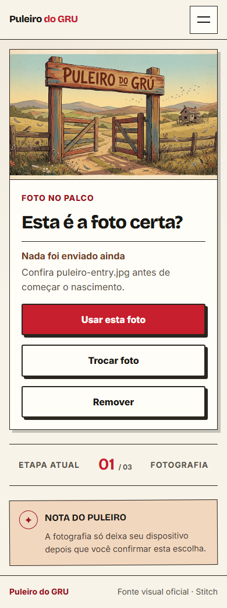
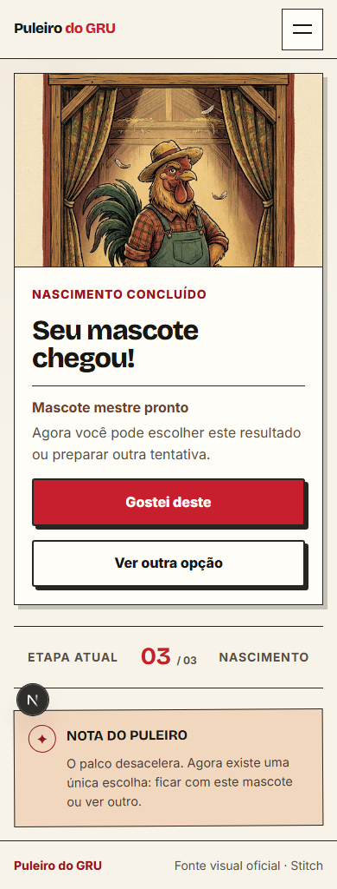

# feat: integrate mascot master generation flow

## Resumo

Substitui o temporizador demonstrativo por uma arquitetura preparada para geração real do mascote mestre:

```text
entry → photo-selection → photo-preview → uploading → creating-job
→ preparing → master-ready → master-approved | master-rejected
```

Inclui recuperação por `recoverable-error`, sem implementar poses, pacote, código do mascote, instalação, pagamento, publicação ou biblioteca.

## Arquitetura

- API intermediária Next.js para criar e consultar jobs;
- proxy privado para a imagem mestre do Modal;
- interface `MascotGenerationProvider`;
- providers `mock` e `modal` selecionados por ambiente;
- validação JPEG/PNG/WebP no cliente e decodificação/tamanho/dimensões no servidor;
- polling cancelável, com backoff e timeout;
- aprovação somente local nesta fase.

## Screenshots

### Confirmação da foto — 390 px



### Mascote mestre — 390 px



## Testes

- `npm run lint`: passou;
- `npx tsc --noEmit`: passou;
- `npm run build`: passou;
- smoke da API de produção: `POST 202`, job `succeeded`, inexistente `404`;
- fluxo completo e console: Chromium, Firefox, WebKit e Edge passaram;
- reflow: 360, 390, 430, 768, 1024 e 1440 passaram;
- `prefers-reduced-motion`: passou;
- detector Impeccable: zero ocorrências;
- suíte Playwright completa está escrita, mas o worker oficial foi bloqueado por `spawn EPERM` no sandbox Windows. A validação equivalente foi executada diretamente nos quatro motores.

## Impeccable

- `/impeccable shape`: preservou uma decisão por vez e a narrativa do Puleiro;
- `/impeccable critique`: 37/40; detector limpo; reduziu peso da ação terciária e removeu nome cru do arquivo;
- `/impeccable adapt`: mesma árvore responsiva; enquadramento `contain` para foto e mestre;
- `/impeccable polish`: recuperação de falha da imagem, hover, validação antecipada e IDs protegidos.

## Riscos e pendências

- ativação real depende de emissão e renovação de Firebase ID token e App Check;
- URL/deploy e kill switch de GPU Modal ainda precisam de validação integrada;
- retenção/exclusão da foto precisa de política de produto comprovada;
- estado e aprovação são temporários e não sobrevivem a refresh;
- fontes aprovadas ainda são remotas.

## Instruções de revisão

1. Copiar `.env.example` para `.env.local` e manter `MASCOT_GENERATION_PROVIDER=mock`.
2. Rodar lint, TypeScript, build e Playwright.
3. Revisar seleção, preview, remoção, substituição, geração, retry e nova opção.
4. Confirmar que ações finais não aparecem antes do reveal.
5. Não ativar Modal/GPU até resolver autenticação e ambiente.

Não fazer merge automático. Esta fase deve parar no mascote mestre.
