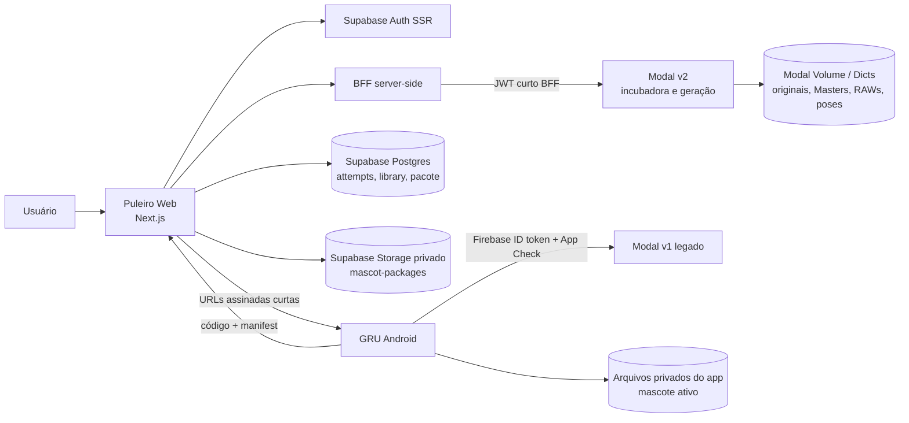

# 01 — Arquitetura real do ecossistema

## Visão geral

O ecossistema tem dois caminhos de mascote que coexistem:

1. **Android V1 / Modal v1**: o app GRU conversa diretamente com o Modal usando Firebase ID token e App Check. É um contrato separado.
2. **Puleiro Web / Modal v2**: o browser autentica no Supabase e chama apenas o BFF Next.js; o BFF assina um JWT curto e owner-scoped para o Modal.

O pacote Android é produzido pelo Web a partir de poses existentes. O Modal gera assets, mas não é a fonte de verdade do pacote publicado.

## Responsabilidades e fronteiras

| Componente | Responsabilidade encontrada | Não é sua responsabilidade |
| --- | --- | --- |
| GRU Android | Ditado, overlay, estado local, validação e promoção local do pacote. | Orquestrar a Incubadora Web ou decidir ranking v2. |
| Puleiro Web | UX, sessão Supabase, BFF, attempts, biblioteca, publicação de pacote. | Expor secrets Modal ao browser ou executar GPU diretamente. |
| Modal | Jobs assíncronos, geração, QC, volumes, gates e assets privados. | Biblioteca final e pacote Android publicados. |
| Supabase | Auth, RLS, metadados owner-scoped, Storage privado do pacote. | Worker de geração. |

## Comunicação síncrona e assíncrona

- **Síncrona:** browser → API Next; BFF → Modal para registro, consulta, seleção e streaming privado; Android → Modal v1; Android → endpoint Web de importação quando um resolver estiver configurado.
- **Assíncrona:** job Modal, reconciliador e workers de Master/poses. O Web consulta o estado; não deve inferir que uma request criou ou concluiu GPU sem confirmação do job.
- **NÃO VERIFICÁVEL:** broker externo, outbox implantado, tracing distribuído e alertas ativos no runtime não foram confirmados nesta investigação.

## Decisões arquiteturais confirmadas

1. **BFF como fronteira Web→Modal:** a sessão Supabase é validada no servidor e o browser não recebe credencial Modal.
2. **Owner scope em camadas:** RLS limita registros Supabase; o BFF monta `JobIdentity` com owner e attempt; Modal v2 valida a identidade BFF.
3. **Pacote separado da geração:** gerar poses não equivale a pacote pronto nem a instalação Android.
4. **Dois contratos Android/Web:** o contrato Android v1 usa Firebase/App Check; Puleiro Web usa Supabase/BFF. Não os misturar silenciosamente.

## Divergência a preservar

`modal_service/ARCHITECTURE.md` em `main` descreve um fluxo de seis poses MVP e Android que baixa assets do Modal. Já o contrato Web/Android V1 atual aponta para três roles operacionais e pacote publicado pelo Web. Tratar esse documento Modal como histórico parcialmente divergente até revisão explícita.

## Fontes no código

- Web: `README.md`, `lib/mascot-generation/modal-auth.ts`, `lib/mascot-generation/modal-provider.ts`.
- Modal: `modal_service/ARCHITECTURE.md`, `modal_service/app.py`, `modal_service/bff_auth.py`.
- Android: `app/build.gradle.kts`, `app/src/gru/kotlin/com/pguillen/gru/mascot/MascotApi.kt`, `.../importing/MascotPackageInstaller.kt`.
