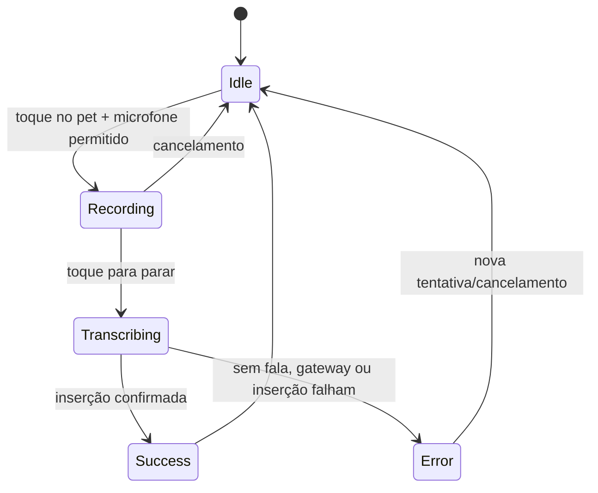

# 02 — GRU Android

## Finalidade e stack

**IMPLEMENTADO no código:** GRU é um app Android Kotlin/Jetpack Compose de ditado com mascote flutuante. O pacote usa namespace e application ID `com.pguillen.gru`, Compose, Firebase Auth, Firebase App Check e um runtime local baseado em `whisper.cpp`.

Entry points principais:

- `GruApplication.kt`: inicialização de preferências, modelos e serviços de app.
- `GruActivity.kt`: atividade principal e navegação Compose.
- `GruAccessibilityService.kt`: observa foco/campo editável/IME, injeta texto e cria o overlay.
- `GruPetOverlayController.kt`: renderiza e controla o mascote flutuante.

## Ditado: máquina de estado própria



`GruSessionCoordinator` controla a máquina. Ele grava áudio temporário, escolhe um gateway uma vez por sessão, insere o texto via acessibilidade e apaga o arquivo de áudio no `finally`. Os modos confirmados no README são Groq online e Whisper local; o app não usa fallback automático de um para outro.

Esta máquina não é controlada pelo Modal nem pelo Puleiro. Ela deve permanecer independente da máquina de estado da Incubadora.

## Permissões e lifecycle

O manifesto principal declara `INTERNET`, `RECORD_AUDIO`, notificação e serviço foreground de microfone. `GruAccessibilityService` é exportado e protegido por `BIND_ACCESSIBILITY_SERVICE`. O app desabilita backup e cleartext traffic.

O overlay só deve ficar visível quando a política local permitir: app habilitado, engine disponível, campo editável focado e IME visível. Campos de senha são deliberadamente excluídos pela heurística de acessibilidade.

## Mascotes no Android

Há dois tipos de origem:

- **Built-in:** atlas incluídos nos recursos do APK.
- **Custom:** `CustomMascotStore` em `filesDir/mascots`, resolvido por `MascotVisualResolver` por estado local `IDLE`, `RECORDING`, `TRANSCRIBING`.

O armazenamento local valida checksum antes de usar um arquivo. A promoção escreve em staging, substitui o diretório de destino de forma recuperável e só então elimina o backup.

## Contrato do pacote Android V1

**IMPLEMENTADO no código:** `MascotImportManifest` suporta schema `1` e exige exatamente três roles distintas:

| Role de pacote | Estado visual Android |
| --- | --- |
| `NORMAL` | `IDLE` |
| `LISTENING` | `RECORDING` |
| `TRANSCRIBING` | `TRANSCRIBING` |

O manifest exige preview igual à pose `NORMAL`, SHA-256, tamanho, MIME permitido e IDs seguros. O instalador recusa pacote parcial, MIME/size/dimensões/checksum inválidos e só promove as três poses juntas. Download permite somente HTTPS público, sem redirecionamento livre para hosts locais/privados.

**BLOQUEADO/PENDENTE:** em `main`, o resolver de código é `UnavailableMascotCodeResolver`; o próprio código diz que a resolução de produção pelo endpoint Web é futura. Portanto, não afirmar que a importação end-to-end já está ativa só porque o parser e instalador existem.

## API Android legado

`MascotApi.kt` chama rotas `/v1/mascot/...` no Modal e usa Firebase token + App Check. Esse caminho é separado do BFF Supabase do Puleiro. A URL é definida no `BuildConfig` de Android; não documentar nem alterar valores de ambiente como se fossem configuração Web.

## Testes e build

Comandos declarados no README:

```powershell
.\gradlew.bat :app:assembleDebug
.\gradlew.bat :app:testDebugUnitTest
.\gradlew.bat :app:lintDebug
.\gradlew.bat :app:connectedDebugAndroidTest
```

**NÃO VERIFICÁVEL nesta investigação:** execução atual desses comandos, dispositivo conectado, release instalado e importação real por código.

## Fontes no código

- `Pguillen87/gru@0f93306`: `README.md`, `app/build.gradle.kts`, `app/src/gru/AndroidManifest.xml`.
- `.../dictation/GruDictationState.kt`, `.../GruSessionCoordinator.kt`.
- `.../overlay/GruAccessibilityService.kt`, `.../overlay/GruPetOverlayController.kt`.
- `.../mascot/CustomMascotStore.kt`, `.../mascot/MascotApi.kt`, `.../mascot/importing/MascotImportModels.kt`, `MascotPackageInstaller.kt`, `MascotCodeResolver.kt`.
