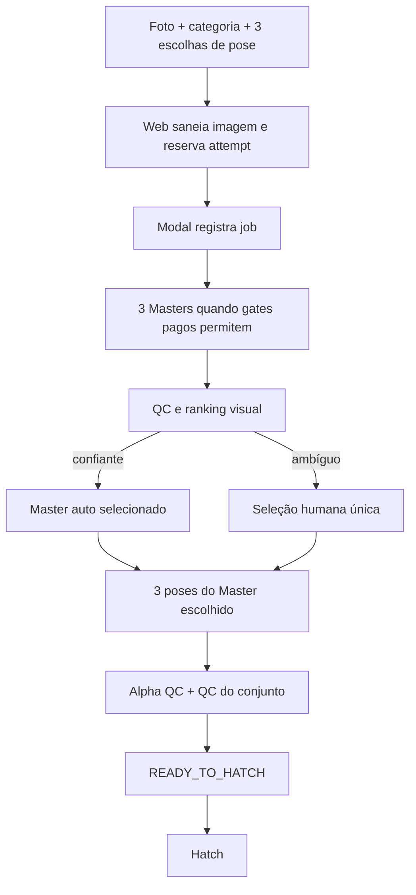

# 04 — Incubadora e pipeline de imagens

## Fluxo assíncrono observado no código

O diagrama mostra a intenção e os contratos encontrados; não significa que cada transição esteja ativa em Production.

## Estágio por estágio

| Estágio | Evidência | Estado atual |
| --- | --- | --- |
| Upload, EXIF removal e confirmação de sujeito | BFF Web e testes | IMPLEMENTADO |
| Attempt owner-scoped e registro assíncrono | `main` Web/Modal após PRs #9 mergeados | IMPLEMENTADO |
| SigLIP ONNX CPU para hint/ranking | `modal_service/incubator.py` | IMPLEMENTADO no código; runtime Production NÃO VERIFICÁVEL |
| Política `master-ranker-policy-v1` | `incubator.py`, ADR e testes | IMPLEMENTADO no código |
| Seleção humana de Master | rotas de incubação e Web | IMPLEMENTADO no código; QA histórico registrado nos PRs anteriores |
| Geração de poses | Modal v2 e templates | IMPLEMENTADO com gates; runtime depende de flags/templates |
| QC `pose-set-visual-v2` | `main` Modal | IMPLEMENTADO, mas o job QA de referência encontrou falso positivo visual |
| QC `pose-set-visual-v3` e recovery CPU | Modal PR aberto | EM ANDAMENTO |
| READY_TO_HATCH endurecido e hatch Web | Web PR aberto | EM ANDAMENTO |

## Visual encoder, ranking e seleção

O Modal `main` contém `OnnxVisualEncoder` que exige manifest/checksum e cria `onnxruntime.InferenceSession` somente com `CPUExecutionProvider`. Ausência, checksum inválido ou provider diferente falham fechado.

`master-ranker-policy-v1` é deliberadamente conservadora: elegibilidade vem de hard gates; 0 elegíveis falha, 1 elegível pede humano, 2–3 podem auto-selecionar somente quando score e margem atendem a política publicada. Os valores devem ser lidos de `modal_service/incubator.py`, não reinventados em cliente.

**NÃO VERIFICÁVEL:** Qwen e SAM 2 como componentes ativos no `main` consultado. Eles foram pedidos como tópicos de investigação, mas não foram confirmados nesta leitura como dependências/código operacional do fluxo atual.

## Imagens, alpha e assets

O pipeline Modal possui módulos de processamento e QC. A geração guarda assets privados no Volume Modal; o BFF entrega Master/poses por proxy owner-scoped. O pacote Android final é outra cópia controlada no Supabase Storage.

O job QA histórico de referência teve três RAWs gerados e preservados, mas foi reprovado por `VISUAL_POSE_CONSISTENCY_FAILED` no QC v2. A evidência registrada no PR Modal #11 classifica o conjunto como visualmente coerente e aponta o QC geométrico como excessivamente rígido para diferenças legítimas de role. Essa conclusão é **QA HISTÓRICO DOCUMENTADO EM PR**, não validação Production.

## QC V2 e V3

`pose-set-visual-v2` continua em `main` para auditoria histórica. O PR Modal #11 propõe v3 role-aware, hard gates adicionais de framing e recovery CPU dos RAWs preservados. Até merge, o v3 não deve ser tratado como contrato publicado.

## O que nunca fazer no pipeline

- Não gerar poses para todos os Masters; gerar somente para o Master aprovado.
- Não repetir GPU após timeout/estado ambíguo antes de verificar call, operação e output persistidos.
- Não promover conjunto parcial.
- Não expor RAW, foto, embedding, path do Volume ou URL privada no browser/log.
- Não modificar thresholds só para aprovar um único exemplo QA.

## Fontes no código

- Modal `main`: `modal_service/incubator.py`, `image_processing.py`, `app.py`, `templates.py`, `catalog.py`.
- Web `main`: `docs/ASYNC_INCUBATOR_V1.md`, `lib/mascot-generation/incubation-input.ts`, `types.ts`.
- PR pendente: `Pguillen87/gru#11`.
