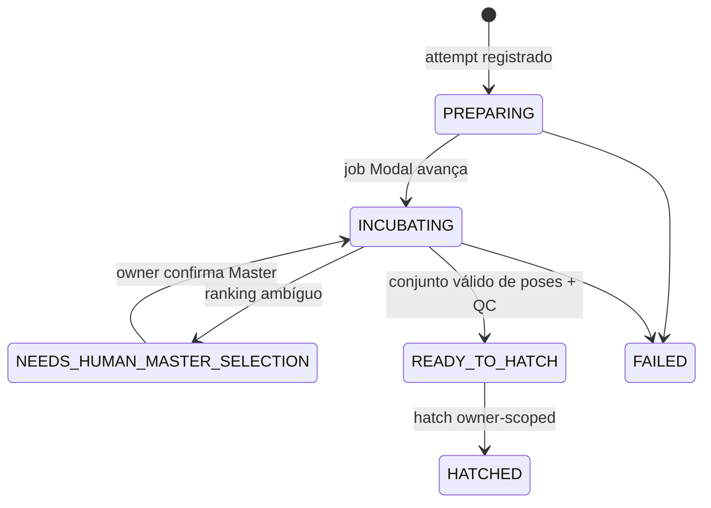
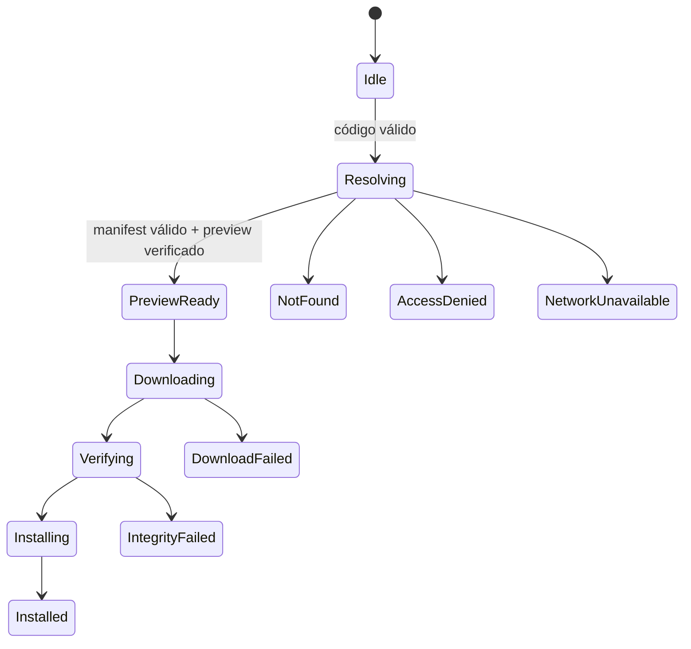

# 05 — Máquinas de estado

## Regra de autoridade

Há máquinas separadas. Android decide seu estado de ditado/overlay local; Modal decide estados de job de geração; Supabase guarda a projeção/recovery Web; Puleiro projeta estados de produto. Nenhuma camada deve fingir ser a autoridade de outra.

## Incubadora Web/Modal

`IncubationProductState` no Web inclui `PREPARING`, `INCUBATING`, `NEEDS_HUMAN_MASTER_SELECTION`, `READY_TO_HATCH`, `HATCHED` e `FAILED`. É uma projeção; não criar uma segunda tabela de estados apenas para a UI.

### Invariante de `READY_TO_HATCH`

O invariante forte — Master aprovado, roles exatos `normal/listening/transcribing`, três assets, alpha/QC de conjunto, manifest/storage e evidência de conclusão — é **EM ANDAMENTO** no Modal PR #11 e no Web PR #11. O `main` atual não deve ser presumido como equivalente até merge e testes QA.

### Estados de job

O tipo Web contém valores como `registered`, `queued`, `generating_master`, `awaiting_master_selection`, `master_approved`, `generating_poses`, `awaiting_set_approval`, `completed`, `failed` e `canceled`. Modal é a fonte de verdade para o job; a tabela Supabase mantém `current_stage`/metadados de tentativa para recuperação.

## Android: ditado

`GruSessionCoordinator` usa `Idle`, `Recording`, `Transcribing`, `Success` e `Error`. Não se mistura com `READY_TO_HATCH` ou qualquer estado Modal.

## Android: importação de pacote

O instalador só promove o pacote quando possui e verifica as três poses. Falhas não ativam pacote parcial.

## Estados proibidos ou suspeitos

- `READY_TO_HATCH` com menos de três poses ou QC ausente: deve falhar fechado.
- HATCHED que cria package, biblioteca ou código Android automaticamente: fora do Plano 1 e não assumir.
- Job de outro owner recuperado por ID: proibido.
- Retry GPU sem checar operação anterior: proibido.

## Fontes no código

- Web: `lib/mascot-generation/types.ts`, `attempt-store.ts`, `docs/ASYNC_INCUBATOR_V1.md`.
- Android: `.../dictation/GruDictationState.kt`, `.../MascotCreation.kt`, `.../importing/MascotImportCoordinator.kt`.
- Modal: `modal_service/domain.py`, `modal_service/v2_contract.py`; PR #11 para invariantes pendentes.
