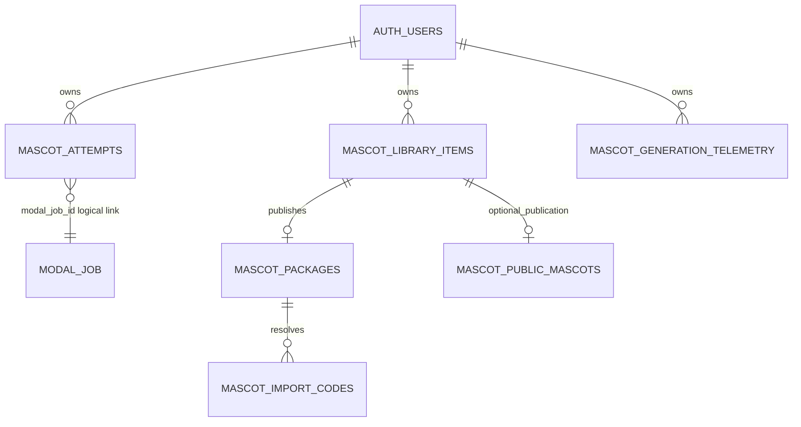

# 07 — Dados, Supabase e Storage

## O que é confirmado por migrations

As migrations versionadas do repositório Web criam e evoluem o modelo. Isso prova o esquema pretendido no código, não a aplicação em cada ambiente remoto.

| Entidade | Finalidade | Owner scope |
| --- | --- | --- |
| `mascot_attempts` | Tentativa Web, attempt ID, status, job Modal, configuração e recovery da Incubadora. | `user_id`; RLS para `auth.uid()`. |
| `mascot_library_items` | Biblioteca privada de mascotes concluídos. | `user_id`; RLS. |
| `mascot_generation_telemetry` | Métricas privadas de duração/custo somente quando verificáveis. | `user_id`; RLS. |
| `mascot_public_mascots` | Projeção explicitamente publicada para comunidade. | Publicação controlada pelo owner. |
| `mascot_public_mascot_favorites` / `saves` | Relações pessoais na comunidade. | `user_id`; RLS. |
| `mascot_packages` | Pacote Android V1 e manifest de entrega. | Owner/package via BFF e RLS declarada na migration. |
| `mascot_import_codes` | Código de importação, expiração/revogação e pacote relacionado. | Acesso indireto pelo BFF. |

## Attempt e Incubadora

A migration `20260829224244_add_async_incubator_attempt_metadata.sql` adiciona `workflow_mode`, configuração da incubação, `subject_hint`, seleção de Master, `generation_ready_at` e `hatched_at`. O check aceita `legacy_manual` e `async_incubator_v1`.

O fluxo deve preservar a unicidade do attempt por owner. Vínculo `modal_job_id` é salvo somente depois de validar que o job Modal pertence ao mesmo attempt.

## Pacote e bucket

O código Web chama o bucket privado `mascot-packages`. `package-store.ts` normaliza as três poses com Sharp, calcula SHA-256 e persiste manifest/asset metadata. A resolução por código deve gerar URL assinada curta, não tornar o bucket público.

O pacote operacional exige exatamente as três roles. O Master não integra o manifest Android V1.

## Relações simplificadas

`MODAL_JOB` não é tabela Supabase confirmada; representa o record persistido pelo Modal.

## Migrations encontradas

| Migration | Efeito principal |
| --- | --- |
| `20260813221145_create_mascot_attempts.sql` | tabela, índices, trigger de update e RLS de attempts. |
| `20260817143000_create_mascot_library_items.sql` | biblioteca e RLS. |
| `20260817180000_add_puleiro_community_and_telemetry.sql` | telemetria e comunidade. |
| `20260818120000_create_mascot_packages_and_import_codes.sql` | pacote, import codes e bucket/policies associados. |
| `20260825225134_harden_mascot_asset_quality_and_states.sql` | endurecimento de qualidade/estados. |
| `20260829224244_add_async_incubator_attempt_metadata.sql` | metadados da Incubadora. |

## Limites de evidência

- **NÃO VERIFICÁVEL:** migrations aplicadas em QA ou Production, conteúdo de buckets, backups, retenção e restores.
- Não usar service role no browser. O uso administrativo existe apenas em módulo servidor e não prova autorização ampla em rotas de usuário.
- Não registrar IDs reais de usuário, códigos de importação, assets ou dados de produção nesta documentação.

## Fontes no código

- `supabase/migrations/*.sql`.
- `lib/mascot-generation/attempt-store.ts`, `library-store.ts`, `package-store.ts`, `community-store.ts`.
- `docs/MASCOT_PACKAGE_V1.md`, `docs/MASCOT_PACKAGE_IMPORT.md`.
